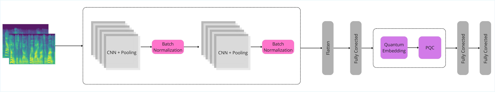

# Private Delegated Hybrid QNN for Speech Emotion Recognition

This project demonstrates a privacy-secure protocol implementation for a hybrid classical-quantum neural network (QNN) applied to speech emotion recognition tasks. The system combines classical convolutional neural networks (CNNs) with quantum neural networks while maintaining privacy through a delegated quantum computation approach. It implements the protocol presented in `Private Delegated Hybrid QNN for Speech Emotion Recognition` paper. This repo assumes you start from a PyTorch model trained with a Qiskit Machine Learning using `TorchConnector`.

## Architecture

### Model Structure

The hybrid model consists of two main components:

1. **Classical CNN Backbone** (`CNN_QNN`):
   - 5-layer convolutional architecture with batch normalization
   - Input: a batch of log-Mel spectrograms `[B, 1, 64, 129]` for this example
   - Feature extraction through progressive downsampling
   - Global average pooling and layer normalization

2. **Quantum Neural Network Head**:
   - 4-qubit quantum circuit with Ry rotation encoding
   - Strong entangling ansatz with 2 repetition layers
   - Pauli-Z observables for expectation value measurements
   - TorchConnector integration for seamless PyTorch compatibility

An overview of the architecture is presented below:

## License

This project is licensed under the MIT License - see the [LICENSE](LICENSE) file for details.

